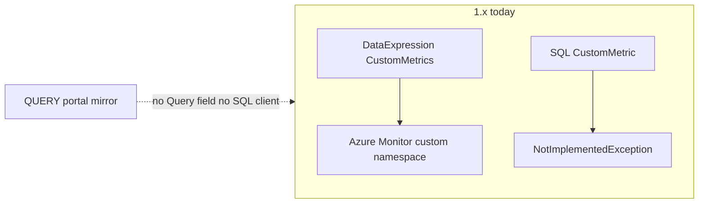

Developer review: in progress — 2026-09-15T07:34:02.0868176Z

IssueKey: 2026-09-15-sql-query-synthetic-metrics
JobName: 2026-09-15-sql-query-synthetic-metrics

## What this changes
**Operators.** None.

**Admin users.** None.

**Developers.** None on `1.x` yet; explore reproduced the QUERY gap and proposed extending `CustomMetrics` / `CustomMetricConfig` instead of a new synthetic type (`devstate/2026/09/2026-09-15-sql-query-synthetic-metrics/explore.md`).

**End users.** None.

## Motivation
Operators need portal-visible DTU, CPU, memory, and data I/O on SQL resources that match the primary database charts. On `1.x`, `CustomMetrics` only evaluates `DataExpression`; SQL `CustomMetric()` throws; there is no QUERY value source and no SQL driver in `autoscaler/`.

Without a query-backed push path, those portal-mirror numbers cannot be published. Log I/O on read-only replicas stays out of scope.

## Merge readiness
Explore complete; waiting on human confirmation of assumed decisions and the CustomMetrics reshape. 6 workflow phases remain.

Priority: P2 — operator and dashboard parity pain with partial native-metric workarounds today.

Reviewed head: 8df73ee
Owner decision: Required. See Explore Decisions.

## Review scores
| Measure | Result | What it means |
| --- | --- | --- |
| Overall readiness | N/A | No product delta on the branch yet |
| CI proof | N/A | prHost local |
| Local tests proof | N/A | localTests none before implement |
| Review resolution | N/A | No OPEN PR |

## Verification
| Check | Result | Evidence |
| --- | --- | --- |
| Branch | 2026-09-15-sql-query-synthetic-metrics not pushed | git |
| OpenSpec | none | handoff.yaml change |
| Pull request | none | prHost local |
| CI | N/A | prHost local |
| Local tests | none | handoff.yaml |
| PR comments | no comments | comments none |

## Specs
None.

## Deviations from the ask
- proposed: ticket “synthetic metrics that use a QUERY” → extend existing `CustomMetrics` / `CustomMetricConfig` with an exclusive Query value source — `autoscaler/configuration/CustomMetricConfig.cs` — honouring “synthetic” as its own config tree would add a parallel publication unit next to `CustomMetrics`. Requester: not asked.

## Follow-up issues
- [ ] [Rename `CustomMetric()` vs `CustomMetrics` stems](knowledge/debt/2026-09-15-rename-custommetric-vs-custommetrics.md) — `CustomMetric()` (in-process gather) and `CustomMetrics` (push) share a stem but are two jobs.

## How this fits together
Local ticket → branch `2026-09-15-sql-query-synthetic-metrics` from `1.x` → explore recorded in `explore.md` → durable card at `devstate/2026/09/2026-09-15-sql-query-synthetic-metrics/card.md`. No remote PR or CI.

## Explore Decisions
| Question | Rank | Decision | By |
| --- | --- | --- | --- |
| What YAML fields does QUERY take (text, database name, timeout, result column)? | additive asked | assumed — optional `Query` string XOR `DataExpression`; optional `Database` (required at runtime for Elastic Pool and when the server has more than one usable DB); optional timeout defaulting to ~30s; value = first row, first numeric column. No connection-string field. | explore |
| Do QUERY metrics feed scaling (`Metrics` / `custom_*`), push-only (`CustomMetrics`), or both? | additive asked | assumed — push-only via `CustomMetrics`. Scale later by reading the custom namespace. Do not wire QUERY into SQL `CustomMetric()`. | explore |
| What are the authoritative portal formulas / DMVs per engine for DTU, CPU, memory, and data I/O? | additive incidental | assumed — operators supply the SQL; docs may show placeholders only. Do not invent vendor facts. | explore |
| Who already owns the identity used to open a SQL session? | additive asked | assumed — reuse the process `TokenCredential` from `Program`. No SQL password/secret config. | explore |
| What host and database does Elastic Pool (and Flexible Server) QUERY connect to? | additive asked | assumed — host from refreshed ARM `ResourceId`; `Database` on the metric selects the catalog. | explore |
| How is “not log I/O on read-only replicas” enforced? | additive asked | assumed — operators target the ResourceId and omit log I/O QUERY. No replica filter in product. | explore |
| How is the QUERY session kept read-only? | additive asked | assumed — open the driver session read-only when the client API supports it; do not rewrite operator SQL. Failed QUERY skips that metric push. | explore |
| Must QUERY return a single scalar, or may it return a named column / many rows? | additive asked | assumed — first row, first numeric column. Extra rows/columns ignored. Non-numeric or empty result skips the push. | explore |

## Before merge
- [ ] Confirm the proposed reshape: `CustomMetrics` + `Query` (not a new `SyntheticMetrics` type)
- [ ] Confirm the eight assumed explore decisions before propose

## Findings
None.

## Axis review
None.

## Agent review details

### Review metrics
| Metric | Value | Why it matters |
| --- | --- | --- |
| Specs in this PR | none | No openspec change yet |
| Open reviewer comments walked | 0 open | No PR inventory |
| Reviewed head | 8df73eea2e238f0cc53c3447d9945e7fa53a6c59 | Card matches measured HEAD |

### Stored data model
None.

### Technical review
Best possible solution: Extending `CustomMetricConfig` with a Query XOR `DataExpression` source, pushed by `CustomMetricsPusher`, matches the existing publication unit on `1.x`.

Do we have a high-confidence way to reproduce? Yes — throwaway console against live types: SQL `CustomMetric()` throws; `CustomMetricConfig` has no `Query`; `PrepareAndValidate` requires `DataExpression`.

Is this the best way to solve the issue? Yes versus `1.x`, if the requester accepts the CustomMetrics reshape; a second synthetic config tree would duplicate publication.

### Evidence
What I checked:
- `explore.md` reproduce table (throwaway console + live types)
- `CustomMetricConfig` properties in `autoscaler/configuration/CustomMetricConfig.cs` (no Query)
- SQL `CustomMetric()` stubs / base throw (PostgreSQL, MySQL, SQL DB, Elastic Pool)
- DestBranch merge-base `a3f37c5`; reviewed HEAD `8df73ee`

### Rank-up moves
None.
