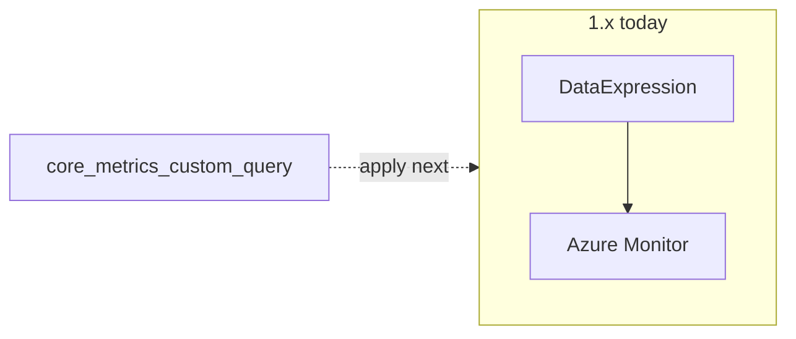

Developer review: in progress — 2026-09-15T08:54:21.3474165Z

IssueKey: 2026-09-15-sql-query-synthetic-metrics
JobName: 2026-09-15-sql-query-synthetic-metrics

## What this changes
**Operators.** None yet on `1.x`; apply will add Query-backed CustomMetrics and SQL login docs (`VIEW DATABASE STATE`).

**Admin users.** None.

**Developers.** OpenSpec change `sql-query-custom-metrics` is apply-ready: new spec `core_metrics_custom_query` (Query XOR DataExpression, implied catalogs, first-row numeric columns).

**End users.** None.

## Motivation
Operators need portal-visible DTU, CPU, memory, and data I/O published from SQL. On `1.x` CustomMetrics only evaluates DataExpression and SQL CustomMetric throws. The change artifacts describe the Query path; product code has not landed yet.

## Merge readiness
Propose complete; implement is next. 5 workflow phases remain.

Priority: P2 — operator and dashboard parity pain with partial native-metric workarounds today.

Reviewed head: 66125b0
Owner decision: Required. See Explore Decisions.

## Review scores
| Measure | Result | What it means |
| --- | --- | --- |
| Overall readiness | N/A | Apply not started |
| CI proof | N/A | prHost local |
| Local tests proof | N/A | localTests none before implement |
| Review resolution | N/A | No OPEN PR |

## Verification
| Check | Result | Evidence |
| --- | --- | --- |
| Branch | 2026-09-15-sql-query-synthetic-metrics not pushed | git |
| OpenSpec | sql-query-custom-metrics | openspec status 4/4 |
| Pull request | none | prHost local |
| CI | N/A | prHost local |
| Local tests | none | handoff.yaml |
| PR comments | no comments | comments none |

## Specs
- [core_metrics_custom_query](openspec/changes/sql-query-custom-metrics/proposal.md) — added

## Deviations from the ask
- taken: ticket “synthetic metrics that use a QUERY” → extend `CustomMetrics` / `CustomMetricConfig` with exclusive Query — `autoscaler/configuration/CustomMetricConfig.cs` — avoid a parallel SyntheticMetrics tree. Requester: confirmed.

## Follow-up issues
- [ ] [Rename `CustomMetric()` vs `CustomMetrics` stems](knowledge/debt/2026-09-15-rename-custommetric-vs-custommetrics.md) — `CustomMetric()` and `CustomMetrics` share a stem but are two jobs.
- [ ] [Rename live spec ids to 4-part](knowledge/debt/2026-09-15-rename-live-spec-ids-to-4-part.md) — live `openspec/specs/` ids are kebab-case, not 4-part.

## How this fits together
Local ticket → branch `2026-09-15-sql-query-synthetic-metrics` → change `sql-query-custom-metrics` apply-ready → no remote PR.

## Explore Decisions
| Question | Rank | Decision | By |
| --- | --- | --- | --- |
| Do QUERY metrics feed scaling (`Metrics` / `custom_*`), push-only (`CustomMetrics`), or both? | additive asked | assumed — push-only via `CustomMetrics`. Do not wire QUERY into SQL `CustomMetric()`. | explore |

## Before merge
- [ ] Implement Query path and pass local tests

## Findings
None.

## Axis review
None.

## Agent review details

### Review metrics
| Metric | Value | Why it matters |
| --- | --- | --- |
| Specs in this PR | 1 added / 0 modified | core_metrics_custom_query |
| Open reviewer comments walked | 0 open | No PR inventory |
| Reviewed head | 66125b0 | Propose commit |

### Stored data model
None.

### Technical review
Best possible solution: Extend CustomMetrics with Query XOR DataExpression as specified in the change artifacts.

Do we have a high-confidence way to reproduce? Yes — no Query field on 1.x.

Is this the best way to solve the issue? Yes versus 1.x; artifacts match explore.

### Evidence
What I checked:
- openspec status 4/4 for sql-query-custom-metrics
- proposal/design/tasks/spec on disk
- deviation taken, requester confirmed

### Rank-up moves
None.
