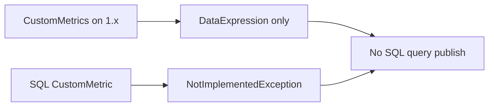

Developer review: ready for review — 2026-09-15T16:42:43.8102668Z

IssueKey: 2026-09-15-sql-query-synthetic-metrics
JobName: 2026-09-15-sql-query-synthetic-metrics

## What this changes
**Operators.** Add a `Query` entry under SQL `CustomMetrics` (XOR `DataExpression`). Azure SQL requires `QueryConnection.ApplicationIntent` (`ReadOnly` or `ReadWrite`); PostgreSQL/MySQL use TLS `VerifyFull`. Create the process identity as a SQL user and `GRANT VIEW DATABASE STATE`. Elastic Pool sessions open `master` — `sys.dm_db_resource_stats` there measures master, not the pool. POST also needs ARM **Monitoring Metrics Publisher**.

**Admin users.** None.

**Developers.** `CustomMetricConfig.Query` / `QueryConnection`, `SqlQuerySessionFactory`, first-row numeric columns and `_min`/`_max`/`_sum`/`_count` stems via `SqlQueryMetricSeriesMapper` and `CustomMetricsPusher`. Startup rejects Azure SQL Query without `ApplicationIntent`. Standalone SQL Database filters use `ElasticPoolId`. Live spec `core_metrics_custom_query`. Usage packet `knowledge/devdocs/core_metrics_custom_query.md`.

**End users.** None.

## Motivation
On `1.x`, CustomMetrics only evaluates DataExpression and SQL `CustomMetric()` throws. Operators cannot publish portal-mirror DTU, CPU, memory, and data I/O from SQL. Without this branch those series stay missing or diverge from the portal, especially on readable secondaries.

## Merge readiness
Ready for review. 0 items remain.

Priority: P2 — operator and dashboard parity pain with partial native-metric workarounds today.

Reviewed head: 2fcca39
Owner decision: Required. See Explore Decisions.

## Review scores
| Measure | Result | What it means |
| --- | --- | --- |
| Overall readiness | 6/6 | CI succeeded; no open PR comments |
| CI proof | 6 | Build and Test succeeded — https://github.com/david-garcia-garcia/azureautoscaler/actions/runs/34996378519/job/104473542072 |
| Local tests proof | N/A | prHost github — CI proof covers remote |
| Review resolution | 6 | No open PR comments |

## Verification
| Check | Result | Evidence |
| --- | --- | --- |
| Branch | 2026-09-15-sql-query-synthetic-metrics pushed | git / origin |
| OpenSpec | sql-query-custom-metrics archived | openspec/changes/archive/2026-09-15-sql-query-custom-metrics |
| Pull request | https://github.com/david-garcia-garcia/azureautoscaler/pull/44 | pr-host List |
| CI | build 34996378519 succeeded https://github.com/david-garcia-garcia/azureautoscaler/actions/runs/34996378519/job/104473542072 | GitHub check runs |
| Local tests | passed | handoff.yaml localTests |
| PR comments | no comments | pull_request_read get_comments |

## Specs
- [core_metrics_custom_query](https://github.com/david-garcia-garcia/azureautoscaler/blob/2026-09-15-sql-query-synthetic-metrics/openspec/changes/archive/2026-09-15-sql-query-custom-metrics/proposal.md) — added
- [resource-instance-filter](https://github.com/david-garcia-garcia/azureautoscaler/blob/2026-09-15-sql-query-synthetic-metrics/openspec/changes/archive/2026-05-04-resource-instance-filter/proposal.md) — modified

## Deviations from the ask
- taken: ticket “synthetic metrics that use a QUERY” → extend `CustomMetrics` with exclusive Query — `autoscaler/configuration/CustomMetricConfig.cs` — avoid a parallel SyntheticMetrics tree. Requester: confirmed.

## Follow-up issues
- [ ] [Rename `CustomMetric()` vs `CustomMetrics` stems](https://github.com/david-garcia-garcia/azureautoscaler/blob/2026-09-15-sql-query-synthetic-metrics/knowledge/debt/2026-09-15-rename-custommetric-vs-custommetrics.md) — `CustomMetric()` and `CustomMetrics` share a stem but are two jobs.
- [ ] [Rename live OpenSpec catalog ids to 4-part slugs](https://github.com/david-garcia-garcia/azureautoscaler/blob/2026-09-15-sql-query-synthetic-metrics/knowledge/debt/2026-09-15-rename-live-spec-ids-to-4-part.md) — live `openspec/specs/` ids are kebab-case, not 4-part.

## How this fits together
Local ticket → branch `2026-09-15-sql-query-synthetic-metrics` from `1.x` → PR 44 → Build and Test succeeded.

## Explore Decisions
| Question | Rank | Decision | By |
| --- | --- | --- | --- |
| Do QUERY metrics feed scaling (`Metrics` / `custom_*`), push-only (`CustomMetrics`), or both? | additive asked | assumed — push-only via `CustomMetrics`. Do not wire QUERY into SQL `CustomMetric()`. | explore |

## Before merge
None.

## Findings
None.

## Axis review
[Standards](https://github.com/david-garcia-garcia/azureautoscaler/blob/2026-09-15-sql-query-synthetic-metrics/devstate/2026/09/2026-09-15-sql-query-synthetic-metrics/codereview_standards.md) — 5 total, 0 pending, 5 completed
[Nitpicks](https://github.com/david-garcia-garcia/azureautoscaler/blob/2026-09-15-sql-query-synthetic-metrics/devstate/2026/09/2026-09-15-sql-query-synthetic-metrics/codereview_nitpicks.md) — 1 total, 0 pending, 1 completed
[Spec](https://github.com/david-garcia-garcia/azureautoscaler/blob/2026-09-15-sql-query-synthetic-metrics/devstate/2026/09/2026-09-15-sql-query-synthetic-metrics/codereview_spec.md) — 0 total, 0 pending, 0 completed
[Security](https://github.com/david-garcia-garcia/azureautoscaler/blob/2026-09-15-sql-query-synthetic-metrics/devstate/2026/09/2026-09-15-sql-query-synthetic-metrics/codereview_security.md) — 1 total, 0 pending, 1 completed
[Performance](https://github.com/david-garcia-garcia/azureautoscaler/blob/2026-09-15-sql-query-synthetic-metrics/devstate/2026/09/2026-09-15-sql-query-synthetic-metrics/codereview_performance.md) — 0 total, 0 pending, 0 completed
[Dead](https://github.com/david-garcia-garcia/azureautoscaler/blob/2026-09-15-sql-query-synthetic-metrics/devstate/2026/09/2026-09-15-sql-query-synthetic-metrics/codereview_dead.md) — 0 total, 0 pending, 0 completed
[Test coverage](https://github.com/david-garcia-garcia/azureautoscaler/blob/2026-09-15-sql-query-synthetic-metrics/devstate/2026/09/2026-09-15-sql-query-synthetic-metrics/codereview_coverage.md) — 4 total, 0 pending, 2 completed, 2 skipped

## Agent review details

### Review metrics
| Metric | Value | Why it matters |
| --- | --- | --- |
| Specs in this PR | 1 added / 1 modified | Same list as ## Specs |
| Open reviewer comments walked | 0 open | Unanswered review is merge risk |
| Reviewed head | 2fcca391611d3745f0df84bc028ae4fe5a09607c | Card must match the branch you measured |

### Stored data model
None.

### Technical review
Best possible solution: Query XOR DataExpression on CustomMetrics, implied catalogs, required Azure SQL ApplicationIntent, windowed series mapper, one session factory.

Do we have a high-confidence way to reproduce? Yes — GitHub Build and Test succeeded on this head.

Is this the best way to solve the issue? Yes versus `1.x`.

### Evidence
What I checked:
- GitHub check run Build and Test succeeded (build 34996378519, SHA 2fcca39)
- Pin `origin/1.x` a3f37c5
- openspec archive `2026-09-15-sql-query-custom-metrics`
- Axis files under the run root (Standards 5 done, Coverage 2 skipped judgement)

### Rank-up moves
None.
