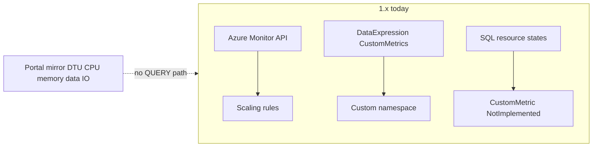

Developer review: in progress — 2026-09-15T07:27:56.3845936Z

IssueKey: 2026-09-15-sql-query-synthetic-metrics
JobName: 2026-09-15-sql-query-synthetic-metrics

## What this changes
**Operators.** None.

**Admin users.** None.

**Developers.** None on `1.x` yet; prepare grounded QUERY-based synthetic metrics for four SQL resource types in `devstate/2026/09/2026-09-15-sql-query-synthetic-metrics/requirement.md`.

**End users.** None.

## Motivation
Teams scale SQL with rules tied to Azure Monitor, but the portal charts DTU, CPU, memory, and data I/O using signals that do not always match what the autoscaler queries—or that are unavailable on the primary path they care about. Read replicas add noise (for example log I/O the ticket excludes). Without a first-class way to run a configured query and publish mirror metrics, operators cannot align dashboards and autoscaler inputs with portal reality across PostgreSQL, MySQL, Azure SQL Database, and elastic pools.

On `1.x`, custom values either come from `DataExpression` pushes (`CustomMetricsPusher`) or hard-coded `custom_*` names on DevOps; SQL `CustomMetric()` overrides are stubs. A QUERY-backed synthetic path is missing, so the portal-mirror goal in the local ticket cannot be implemented yet.

If we never add it, scaling and alerting keep diverging from portal-visible utilization, especially where native metrics lag or differ by engine.

## Merge readiness
Prepare complete; explore is next. 7 workflow phases remain.

Priority: P2 — operator and dashboard parity pain with partial native-metric workarounds today.

Reviewed head: e9a64dd
Owner decision: None.

## Review scores
| Measure | Result | What it means |
| --- | --- | --- |
| Overall readiness | N/A | No product delta on the branch yet |
| CI proof | N/A | prHost local |
| Local tests proof | N/A | localTests none before implement |
| Review resolution | N/A | No OPEN PR |

## Verification
| Check | Result | Evidence |
| --- | --- | --- |
| Branch | 2026-09-15-sql-query-synthetic-metrics not pushed | git |
| OpenSpec | none | handoff.yaml change |
| Pull request | none | prHost local |
| CI | N/A | prHost local |
| Local tests | none | handoff.yaml |
| PR comments | no comments | comments none |

## Specs
None.

## Deviations from the ask
None.

## Follow-up issues
None.

## How this fits together
Local ticket spec → branch `2026-09-15-sql-query-synthetic-metrics` from `1.x` → durable card at `devstate/2026/09/2026-09-15-sql-query-synthetic-metrics/card.md` → no remote PR or CI.

## Explore Decisions
None.

## Before merge
None.

## Findings
None.

## Axis review
None.

## Agent review details

### Review metrics
| Metric | Value | Why it matters |
| --- | --- | --- |
| Specs in this PR | none | No openspec change yet |
| Open reviewer comments walked | 0 open | No PR inventory |
| Reviewed head | e9a64dd | Bus-only prepare |

### Stored data model
None.

### Technical review
Best possible solution: Not evaluated; no apply diff versus `1.x`.

Do we have a high-confidence way to reproduce? No; behavior not implemented.

Is this the best way to solve the issue? Unknown until explore chooses config shape and metric pipeline.

### Evidence
What I checked:
- Ticket dump at `devstate/2026/09/2026-09-15-sql-query-synthetic-metrics/ticket/source.md` (prepare)
- Custom metric paths in `autoscaler/metrics/CustomMetricsPusher.cs`, `autoscaler/metrics/AzureMonitorMetricsGatherer.cs`, SQL resource states (prepare tree walk)
- DestBranch HEAD a3f37c5 (git)

### Rank-up moves
None.
