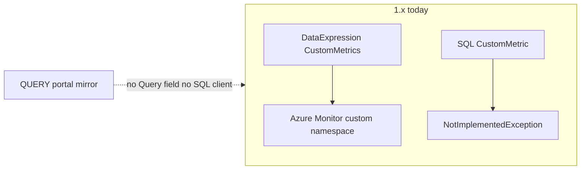

Developer review: in progress — 2026-09-15T08:35:39.8141403Z

IssueKey: 2026-09-15-sql-query-synthetic-metrics
JobName: 2026-09-15-sql-query-synthetic-metrics

## What this changes
**Operators.** None.

**Admin users.** None.

**Developers.** None on `1.x` yet; explore refined QUERY to one statement → many numeric columns, no `Database` field, `ApplicationIntent=ReadOnly`, and operator-owned `replica_role` zeros.

**End users.** None.

## Motivation
Operators need portal-visible DTU, CPU, memory, and data I/O on SQL resources that match the primary-database charts. On `1.x`, `CustomMetrics` only evaluates `DataExpression`; SQL `CustomMetric()` throws; there is no QUERY value source and no SQL driver in `autoscaler/`.

Without a query-backed push path, those portal-mirror numbers cannot be published. Log I/O on read-only replicas stays out of scope. A replica session is not guaranteed by `ApplicationIntent=ReadOnly` (Basic/Standard/General Purpose have no read scale-out).

## Merge readiness
Explore catalogs confirmed (SQL Database = ResourceId database; Elastic Pool = master). Waiting on the CustomMetrics reshape. 6 workflow phases remain.

Priority: P2 — operator and dashboard parity pain with partial native-metric workarounds today.

Reviewed head: 347ec39
Owner decision: Required. See Explore Decisions.

## Review scores
| Measure | Result | What it means |
| --- | --- | --- |
| Overall readiness | N/A | No product delta on the branch yet |
| CI proof | N/A | prHost local |
| Local tests proof | N/A | localTests none before implement |
| Review resolution | N/A | No OPEN PR |

## Verification
| Check | Result | Evidence |
| --- | --- | --- |
| Branch | 2026-09-15-sql-query-synthetic-metrics not pushed | git |
| OpenSpec | none | handoff.yaml change |
| Pull request | none | prHost local |
| CI | N/A | prHost local |
| Local tests | none | handoff.yaml |
| PR comments | no comments | comments none |

## Specs
None.

## Deviations from the ask
- proposed: ticket “synthetic metrics that use a QUERY” → extend existing `CustomMetrics` / `CustomMetricConfig` with an exclusive Query value source — `autoscaler/configuration/CustomMetricConfig.cs` — honouring “synthetic” as its own config tree would add a parallel publication unit next to `CustomMetrics`. Requester: not asked.

## Follow-up issues
- [ ] [Rename `CustomMetric()` vs `CustomMetrics` stems](knowledge/debt/2026-09-15-rename-custommetric-vs-custommetrics.md) — `CustomMetric()` (in-process gather) and `CustomMetrics` (push) share a stem but are two jobs.

## How this fits together
Local ticket → branch `2026-09-15-sql-query-synthetic-metrics` from `1.x` → explore recorded in `explore.md` → durable card at `devstate/2026/09/2026-09-15-sql-query-synthetic-metrics/card.md`. No remote PR or CI.

## Explore Decisions
| Question | Rank | Decision | By |
| --- | --- | --- | --- |
| Do QUERY metrics feed scaling (`Metrics` / `custom_*`), push-only (`CustomMetrics`), or both? | additive asked | assumed — push-only via `CustomMetrics`. Scale later by reading the custom namespace. Do not wire QUERY into SQL `CustomMetric()`. | explore |

## Before merge
- [ ] Confirm the proposed reshape: `CustomMetrics` + `Query` (not a new `SyntheticMetrics` type)
- [ ] Confirm remaining assumed row (push-only)

## Findings
None.

## Axis review
None.

## Agent review details

### Review metrics
| Metric | Value | Why it matters |
| --- | --- | --- |
| Specs in this PR | none | No openspec change yet |
| Open reviewer comments walked | 0 open | No PR inventory |
| Reviewed head | 91d4c26eb47e961c04dc2d6c430656f60133b436 | Card matches last committed HEAD before this Set |

### Stored data model
None.

### Technical review
Best possible solution: One Query on `CustomMetricConfig`, run once, publish each numeric column; connection string built with ApplicationIntent=ReadOnly; operator SQL zeros non-replicas via replica_role.

Do we have a high-confidence way to reproduce? Yes — SQL `CustomMetric()` throws; `CustomMetricConfig` has no `Query`.

Is this the best way to solve the issue? Yes versus `1.x` if the requester accepts CustomMetrics + implied catalog.

### Evidence
What I checked:
- Learn `sys.dm_db_resource_stats` (current database, VIEW DATABASE STATE, replica_role)
- Learn read scale-out (ApplicationIntent=ReadOnly does not exist on Basic/Standard/GP)
- `ResourceStateFactory.SqlDatabase` already captures databaseName
- Requester multi-column QUERY and replica_role zeroing

### Rank-up moves
None.
